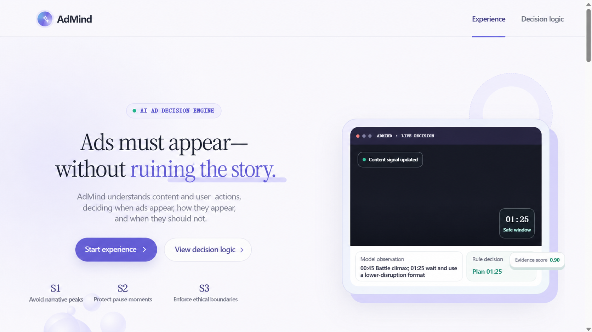
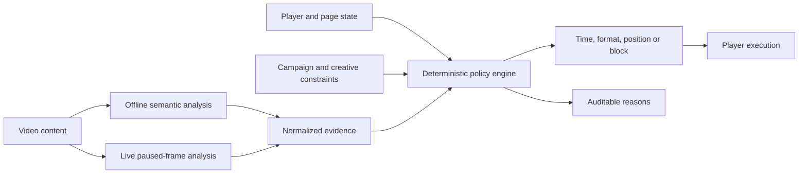
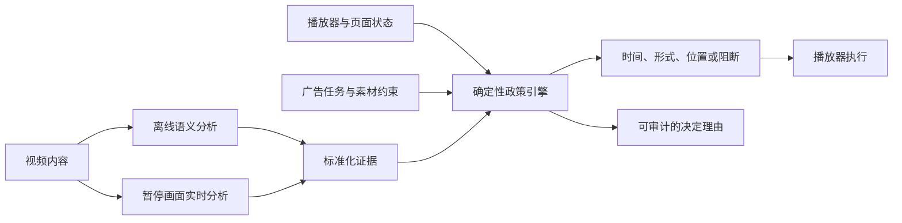

<div align="center">


# AdMind

**An explainable AI decision layer for less disruptive video advertising.**

[](https://github.com/Owl-Lee/AdMind/actions/workflows/ci.yml)
[](https://nodejs.org/)
[](https://www.typescriptlang.org/)
[](#project-status)

[Live demo](https://admind-decision-console.liyanbao06.chatgpt.site/) ·
[Architecture](docs/ARCHITECTURE.md) ·
[Case study](docs/CASE_STUDY.md) ·
[Development](docs/DEVELOPMENT.md) ·
[Roadmap](docs/ROADMAP.md) ·
[中文说明](#中文说明)

</div>



## Overview

AdMind is a policy-first advertising decision prototype for long-form video. Instead of asking only which ad is most valuable, it decides:

- **when** an ad may appear;
- **which format** creates the least disruption;
- **where** a pause ad can be placed without covering important content; and
- **when an ad must not be shown**, even when a campaign still has delivery pressure.

AI supplies bounded evidence about the video. Deterministic rules retain final authority over policy, player state, creative eligibility and protected contexts. Every decision is designed to remain explainable and auditable.

## Product scenarios

| Scenario | Product question | Implemented evidence and behavior |
| --- | --- | --- |
| **S1 · Climax avoidance** | When should an ad appear? | Cached, time-coded TwelveLabs analyses identify narrative segments. AdMind compares a fixed break with a safer window or lower-disruption fallback. |
| **S2 · Pause protection** | Should a pause ad appear, and where? | A browser-side state machine observes pause, resume, seeking, visibility and focus. MediaPipe inspects the paused frame and scores four candidate corners. |
| **S3 · Ethical boundary** | Is advertising allowed here at all? | Rescue, medical and disaster evidence feeds deterministic hard rules that can block in-content advertising regardless of commercial value. |

The live experience presents the three scenarios as one continuous story and exposes the evidence behind each decision.

## Why it is different

- **Policy before ranking** — a high bid or model score cannot override a hard rule.
- **Evidence, not model prose** — provider output is normalized and validated before it reaches the decision engine.
- **Real player state** — pause, resume, seeking, focus and page visibility affect execution.
- **Spatial safety** — pause ads are placed using frame-level risk rather than a fixed corner.
- **Delivery-aware restraint** — an unsafe opportunity can be deferred without pretending the campaign disappeared.
- **Honest boundaries** — model evidence scores are not presented as calibrated probabilities, and the demo does not claim universal scene understanding.

## How it works



- **S1 and S3** use cached TwelveLabs analysis so the public-facing demo does not require a visitor API key or repeat paid inference.
- **S2** runs lightweight MediaPipe inference locally in the browser after a stable pause.
- **All scenarios** use the same typed contracts and deterministic decision layer exposed by the UI and API adapters.

Read [Architecture](docs/ARCHITECTURE.md) for component boundaries and runtime flows.

## Live demo

The hosted product preview is publicly accessible without a sign-in:

**https://admind-decision-console.liyanbao06.chatgpt.site/**

The deployment is a product demonstration, not an advertising network, auction service or production campaign-management platform.

## Quick start

### Requirements

- Node.js 24 or later
- pnpm 11 or later

### Run the web experience

```bash
git clone https://github.com/Owl-Lee/AdMind.git
cd AdMind
pnpm install
pnpm dev
```

Open `http://localhost:3000`.

### Run the standalone API

```bash
pnpm dev:api
```

The Fastify adapter listens on `http://127.0.0.1:4000` by default.

### Run verification

```bash
pnpm check
```

Individual gates are also available:

```bash
pnpm lint
pnpm typecheck
pnpm test:unit
pnpm test:rendered
pnpm build
```

See [Development](docs/DEVELOPMENT.md) for environment variables, analysis commands and repository conventions.

## Optional video analysis

The checked-in demo reads cached, schema-validated analysis JSON. A new licensed video can be analyzed locally with TwelveLabs:

```bash
pnpm analyze:video \
  --provider twelvelabs \
  --file path/to/licensed-video.mp4 \
  --duration 90 \
  --output analysis/runs/example.json \
  --raw-output analysis/raw/example.json
```

Create `.env.local` with `TWELVELABS_API_KEY` before running the command. Never expose provider keys to browser code or commit them to Git.

## API surface

| Method | Route | Purpose |
| --- | --- | --- |
| `GET` | `/api/decisions` | Return the built-in baseline and AdMind scenario comparisons. |
| `POST` | `/api/decisions` | Execute a validated decision request through the shared engine. |
| `GET` | `/v1/scenarios/:id` | Return S1, S2 or S3 from the standalone Fastify adapter. |
| `POST` | `/v1/decisions` | Execute the same engine through the standalone adapter. |

## Repository map

```text
app/                         Product experience and co-located web API
packages/contracts/          Zod contracts and shared TypeScript types
packages/decision-engine/    Hard rules, plan ranking, fixtures and tests
packages/video-analyzer/     Provider adapters, prompts and normalization
services/api/                Standalone Fastify adapter
analysis/runs/               Validated analysis consumed by the demo
analysis/raw/                Provider output retained for traceability
worker/                      Media routing for the deployed experience
docs/                        Architecture, research, specs and handoff notes
tests/                       Rendered-output verification
```

## Documentation

- [Architecture](docs/ARCHITECTURE.md) — system boundaries and runtime flows.
- [Case study](docs/CASE_STUDY.md) — product problem, engineering decisions and interview-ready explanation.
- [Development](docs/DEVELOPMENT.md) — setup, commands and contribution workflow.
- [Roadmap](docs/ROADMAP.md) — staged path from prototype to public release.
- [Video analyzer](docs/VIDEO_ANALYZER.md) — provider contract and evidence pipeline.
- [Decision engine specification](docs/DECISION_ENGINE_SPEC_V1.md) — policy and ranking design.
- [Acceptance tests](docs/ACCEPTANCE_TESTS_V1.md) — behavior-level product criteria.
- [PRD](docs/PRD.md) — product requirements and scope.
- [Engineering handoff](docs/AdMind项目工程交接文档.md) — current facts, validation and next work.
- [Technical walkthrough](docs/AdMind项目技术亮点与讲解.md) — Chinese project explanation and interview narrative.
- [Asset manifest](docs/ASSET_MANIFEST.md) — media and model provenance, licenses, modifications and checksums.

Some design documents preserve earlier planning decisions. The README, engineering handoff and changelog are the authoritative sources for current implementation status.

## Project status

AdMind is a **public, portfolio-grade product prototype**. The complete demonstration path is implemented, but it is not a production ad platform or a claim of measured business uplift.

Current boundaries:

- S1 and S3 prove the pipeline on a fixed set of licensed or public-domain demo clips; they are not broad benchmark results.
- S2 prioritizes recall and conservative avoidance. Animated characters, small subjects and complex backgrounds still need a fixed regression set and calibration.
- Pause thresholds and risk weights are product hypotheses, not industry-optimal constants.
- Deferred delivery is represented within the current session; cross-page and cross-device campaign orchestration is not implemented.
- The public release intentionally omits an earlier optional Sprite Fright sample that did not ship with a reproducible asset workflow.
- The public portfolio uses a project-owned fictional game creative confirmed by the project owner.

See the [Roadmap](docs/ROADMAP.md) for the public-release gates.

## Security and privacy

- Provider keys are local/server-side only and ignored by Git.
- Cached analysis lets visitors use the demo without sending video to an AI provider.
- S2 frame analysis happens locally in the browser.
- The demo observes only its own player and page state; it does not infer user intent or inspect other applications.

Report security issues through the process in [SECURITY.md](SECURITY.md).

## Contributing

Contributions and focused issue reports are welcome. Read [CONTRIBUTING.md](CONTRIBUTING.md) and the [Code of Conduct](CODE_OF_CONDUCT.md) before opening a pull request.

## Licensing and media

No open-source license has been granted for the AdMind source code yet. Unless a file states otherwise, all rights are reserved. Third-party libraries, models and media remain subject to their own licenses and source terms.

See [Third-party notices](THIRD_PARTY_NOTICES.md) and the [asset manifest](docs/ASSET_MANIFEST.md). Media files are distributed only when their source and reuse basis are documented.

---

## 中文说明


## 项目概述

AdMind 是一个面向长视频广告、规则优先的广告决策原型。它不只判断“哪条广告价值最高”，还会决定：

- 广告**什么时候**可以出现；
- **哪种形式**对内容的打断最小；
- 暂停广告应该放在**什么位置**，才能避免遮挡重要画面；
- 即使广告任务仍有交付压力，**什么时候也必须不投放**。

AI 负责提供有明确边界的视频内容证据。确定性规则继续掌握广告政策、播放器状态、广告素材资格和敏感场景保护的最终决定权。每一项决定都以可解释、可审计为设计目标。

## 产品场景

| 场景 | 产品问题 | 已实现的证据与行为 |
| --- | --- | --- |
| **S1 · 剧情高点避让** | 广告应该什么时候出现？ | 使用缓存且带时间码的 TwelveLabs 分析识别叙事片段。AdMind 会比较固定广告点与更安全的窗口，并在必要时选择更低打断的形式。 |
| **S2 · 用户暂停保护** | 暂停时应该投广告吗？应该放在哪里？ | 浏览器端状态机观察暂停、恢复、拖动、页面可见性和焦点。MediaPipe 检查暂停画面，并为四个候选角落计算遮挡风险。 |
| **S3 · 伦理边界** | 这个场景是否允许出现广告？ | 救援、医疗和灾难等证据进入确定性硬规则；无论商业价值多高，规则都可以阻断内容内广告。 |

线上体验把三个场景组织成一条连续叙事，并直接展示每次决定背后的证据。

## 项目差异

- **先执行政策，再进行排序** —— 高出价或高模型评分不能覆盖硬规则。
- **使用证据，而不是模型散文** —— AI 服务商的输出必须先经过标准化与结构校验，才能进入决策引擎。
- **接入真实播放器状态** —— 暂停、恢复、拖动、焦点和页面可见性都会影响实际执行。
- **关注空间安全** —— 暂停广告根据当前帧的遮挡风险选择位置，而不是永远固定在同一个角落。
- **兼顾交付但保持克制** —— 不安全的机会可以被顺延，同时保留广告任务的交付缺口。
- **诚实说明能力边界** —— 模型证据分数不会被包装成校准后的统计概率，Demo 也不宣称能够理解所有场景。

## 工作原理



- **S1 和 S3** 使用缓存的 TwelveLabs 分析，因此对外展示时不需要访客提供 API Key，也不会重复触发付费推理。
- **S2** 在稳定暂停后，直接在浏览器本地运行轻量级 MediaPipe 推理。
- **所有场景** 共用同一套类型契约和确定性决策层，并通过界面和 API 适配器对外提供能力。

组件边界和运行链路详见[架构文档](docs/ARCHITECTURE.md)。

## 在线演示

托管的产品预览已经公开，无需登录即可访问：

**https://admind-decision-console.liyanbao06.chatgpt.site/**

该部署是产品能力演示，不是广告网络、广告竞价服务或生产级广告活动管理平台。

## 快速开始

### 环境要求

- Node.js 24 或更高版本
- pnpm 11 或更高版本

### 运行网页体验

```bash
git clone https://github.com/Owl-Lee/AdMind.git
cd AdMind
pnpm install
pnpm dev
```

打开 `http://localhost:3000`。

### 运行独立 API

```bash
pnpm dev:api
```

Fastify 适配器默认监听 `http://127.0.0.1:4000`。

### 运行完整验证

```bash
pnpm check
```

也可以分别运行各项质量门：

```bash
pnpm lint
pnpm typecheck
pnpm test:unit
pnpm test:rendered
pnpm build
```

环境变量、分析命令和仓库约定详见[开发文档](docs/DEVELOPMENT.md)。

## 可选的视频分析

仓库内置 Demo 读取已经缓存并通过 Schema 校验的分析 JSON。如需分析一条拥有合法使用权的新视频，可以在本地调用 TwelveLabs：

```bash
pnpm analyze:video \
  --provider twelvelabs \
  --file path/to/licensed-video.mp4 \
  --duration 90 \
  --output analysis/runs/example.json \
  --raw-output analysis/raw/example.json
```

执行前，请在 `.env.local` 中设置 `TWELVELABS_API_KEY`。不得把服务商密钥暴露给浏览器代码，也不得提交到 Git。

## API 接口

| 方法 | 路由 | 用途 |
| --- | --- | --- |
| `GET` | `/api/decisions` | 返回内置场景中传统方案与 AdMind 方案的对比。 |
| `POST` | `/api/decisions` | 将通过校验的决策请求交给共享决策引擎执行。 |
| `GET` | `/v1/scenarios/:id` | 通过独立 Fastify 适配器返回 S1、S2 或 S3。 |
| `POST` | `/v1/decisions` | 通过独立适配器执行同一套决策引擎。 |

## 仓库结构

```text
app/                         产品体验与同仓 Web API
packages/contracts/          Zod 契约与共享 TypeScript 类型
packages/decision-engine/    硬规则、方案排序、测试样本与测试
packages/video-analyzer/     AI 服务适配器、提示词与结果标准化
services/api/                独立 Fastify 适配器
analysis/runs/               Demo 使用的已校验分析结果
analysis/raw/                为可追溯性保留的服务商原始输出
worker/                      已部署体验的媒体路由
docs/                        架构、研究、规格与交接文档
tests/                       服务端渲染输出验证
```

## 项目文档

- [架构文档](docs/ARCHITECTURE.md) —— 系统边界和运行链路。
- [案例分析](docs/CASE_STUDY.md) —— 产品问题、工程决策和面试讲解方式。
- [开发文档](docs/DEVELOPMENT.md) —— 环境配置、命令和贡献流程。
- [路线图](docs/ROADMAP.md) —— 从原型到公开发布的阶段计划。
- [视频分析器](docs/VIDEO_ANALYZER.md) —— 服务商契约与证据处理链路。
- [决策引擎规格](docs/DECISION_ENGINE_SPEC_V1.md) —— 政策与排序设计。
- [验收测试](docs/ACCEPTANCE_TESTS_V1.md) —— 产品行为级验收标准。
- [产品需求文档](docs/PRD.md) —— 产品需求与范围。
- [工程交接文档](docs/AdMind项目工程交接文档.md) —— 当前事实、验证结果与后续工作。
- [技术亮点与讲解](docs/AdMind项目技术亮点与讲解.md) —— 中文项目说明与面试叙事。
- [素材清单](docs/ASSET_MANIFEST.md) —— 媒体和模型的来源、许可、修改记录与校验和。

部分设计文档保留了早期规划决策。README、工程交接文档和 Changelog 是当前实现状态的权威事实来源。

## 项目状态

AdMind 是一个**公开、达到作品集展示标准的产品原型**。完整演示链路已经实现，但它不是生产级广告平台，也不代表已经验证真实业务增益。

当前边界包括：

- S1 和 S3 使用一组固定的授权素材或公共领域 Demo 视频证明链路，不代表广泛基准测试结果。
- S2 优先保证召回和保守避让。动画角色、小目标和复杂背景仍需要固定回归样本与进一步校准。
- 暂停阈值和风险权重属于当前产品假设，不是行业最优常数。
- 广告顺延目前只在当前会话中表达，尚未实现跨页面、跨设备的广告任务编排。
- 公开版本有意移除了一个早期可选的 Sprite Fright 样本，因为它没有形成可复现的素材发布流程。
- 公开作品集使用由项目所有者确认拥有使用权的虚构游戏广告素材。

公开发布门槛和后续计划详见[路线图](docs/ROADMAP.md)。

## 安全与隐私

- AI 服务商密钥只在本地或服务端使用，并已被 Git 忽略。
- 缓存分析让访客无需把视频发送给 AI 服务商即可体验 Demo。
- S2 的画面分析在浏览器本地完成。
- Demo 只观察自身播放器和页面状态，不推断用户意图，也不检查其他应用。

安全问题请按照 [SECURITY.md](SECURITY.md) 中的流程报告。

## 参与贡献

欢迎提交聚焦的贡献和问题报告。创建 Pull Request 前，请阅读[贡献指南](CONTRIBUTING.md)和[行为准则](CODE_OF_CONDUCT.md)。

## 授权与媒体素材

AdMind 源代码目前尚未授予开源许可证。除非文件另有说明，否则保留所有权利。第三方库、模型和媒体素材继续遵循各自的许可证与来源条款。

详见[第三方声明](THIRD_PARTY_NOTICES.md)和[素材清单](docs/ASSET_MANIFEST.md)。只有来源与复用依据已经记录的媒体文件才会随仓库发布。
