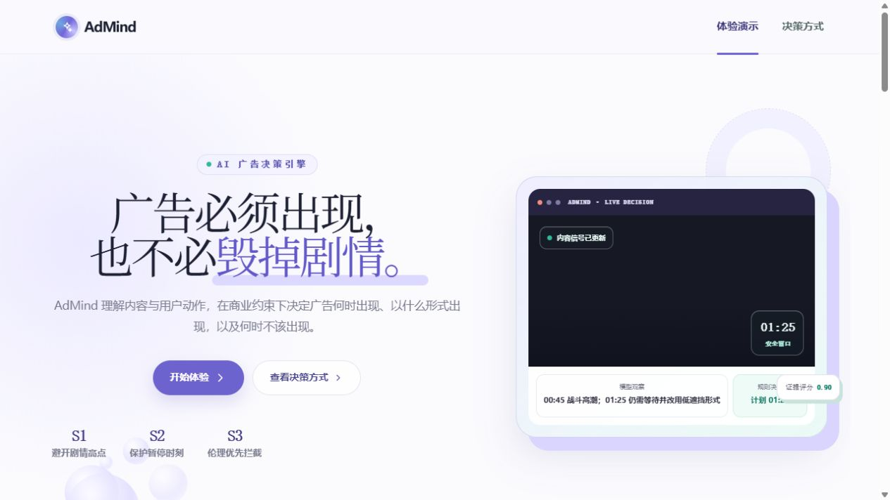
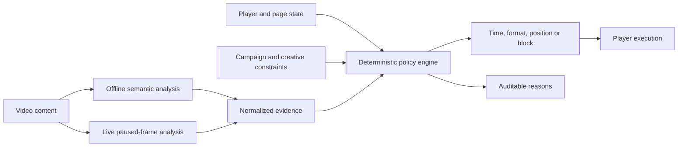

<div align="center">


# AdMind

**An explainable AI decision layer for less disruptive video advertising.**

[](https://github.com/Owl-Lee/AdMind/actions/workflows/ci.yml)
[](https://nodejs.org/)
[](https://www.typescriptlang.org/)
[](#project-status)

[Live demo](https://admind-decision-console.liyanbao06.chatgpt.site/) ·
[Architecture](docs/ARCHITECTURE.md) ·
[Case study](docs/CASE_STUDY.md) ·
[Development](docs/DEVELOPMENT.md) ·
[Roadmap](docs/ROADMAP.md) ·
[中文说明](#中文说明)

</div>



## Overview

AdMind is a policy-first advertising decision prototype for long-form video. Instead of asking only which ad is most valuable, it decides:

- **when** an ad may appear;
- **which format** creates the least disruption;
- **where** a pause ad can be placed without covering important content; and
- **when an ad must not be shown**, even when a campaign still has delivery pressure.

AI supplies bounded evidence about the video. Deterministic rules retain final authority over policy, player state, creative eligibility and protected contexts. Every decision is designed to remain explainable and auditable.

## Product scenarios

| Scenario | Product question | Implemented evidence and behavior |
| --- | --- | --- |
| **S1 · Climax avoidance** | When should an ad appear? | Cached, time-coded TwelveLabs analyses identify narrative segments. AdMind compares a fixed break with a safer window or lower-disruption fallback. |
| **S2 · Pause protection** | Should a pause ad appear, and where? | A browser-side state machine observes pause, resume, seeking, visibility and focus. MediaPipe inspects the paused frame and scores four candidate corners. |
| **S3 · Ethical boundary** | Is advertising allowed here at all? | Rescue, medical and disaster evidence feeds deterministic hard rules that can block in-content advertising regardless of commercial value. |

The live experience presents the three scenarios as one continuous story and exposes the evidence behind each decision.

## Why it is different

- **Policy before ranking** — a high bid or model score cannot override a hard rule.
- **Evidence, not model prose** — provider output is normalized and validated before it reaches the decision engine.
- **Real player state** — pause, resume, seeking, focus and page visibility affect execution.
- **Spatial safety** — pause ads are placed using frame-level risk rather than a fixed corner.
- **Delivery-aware restraint** — an unsafe opportunity can be deferred without pretending the campaign disappeared.
- **Honest boundaries** — model evidence scores are not presented as calibrated probabilities, and the demo does not claim universal scene understanding.

## How it works



- **S1 and S3** use cached TwelveLabs analysis so the public-facing demo does not require a visitor API key or repeat paid inference.
- **S2** runs lightweight MediaPipe inference locally in the browser after a stable pause.
- **All scenarios** use the same typed contracts and deterministic decision layer exposed by the UI and API adapters.

Read [Architecture](docs/ARCHITECTURE.md) for component boundaries and runtime flows.

## Live demo

The hosted product preview may require authorized access while the public deployment policy is finalized:

**https://admind-decision-console.liyanbao06.chatgpt.site/**

The deployment is a product demonstration, not an advertising network, auction service or production campaign-management platform.

## Quick start

### Requirements

- Node.js 24 or later
- pnpm 11 or later

### Run the web experience

```bash
git clone https://github.com/Owl-Lee/AdMind.git
cd AdMind
pnpm install
pnpm dev
```

Open `http://localhost:3000`.

### Run the standalone API

```bash
pnpm dev:api
```

The Fastify adapter listens on `http://127.0.0.1:4000` by default.

### Run verification

```bash
pnpm check
```

Individual gates are also available:

```bash
pnpm lint
pnpm typecheck
pnpm test:unit
pnpm test:rendered
pnpm build
```

See [Development](docs/DEVELOPMENT.md) for environment variables, analysis commands and repository conventions.

## Optional video analysis

The checked-in demo reads cached, schema-validated analysis JSON. A new licensed video can be analyzed locally with TwelveLabs:

```bash
pnpm analyze:video \
  --provider twelvelabs \
  --file path/to/licensed-video.mp4 \
  --duration 90 \
  --output analysis/runs/example.json \
  --raw-output analysis/raw/example.json
```

Create `.env.local` with `TWELVELABS_API_KEY` before running the command. Never expose provider keys to browser code or commit them to Git.

## API surface

| Method | Route | Purpose |
| --- | --- | --- |
| `GET` | `/api/decisions` | Return the built-in baseline and AdMind scenario comparisons. |
| `POST` | `/api/decisions` | Execute a validated decision request through the shared engine. |
| `GET` | `/v1/scenarios/:id` | Return S1, S2 or S3 from the standalone Fastify adapter. |
| `POST` | `/v1/decisions` | Execute the same engine through the standalone adapter. |

## Repository map

```text
app/                         Product experience and co-located web API
packages/contracts/          Zod contracts and shared TypeScript types
packages/decision-engine/    Hard rules, plan ranking, fixtures and tests
packages/video-analyzer/     Provider adapters, prompts and normalization
services/api/                Standalone Fastify adapter
analysis/runs/               Validated analysis consumed by the demo
analysis/raw/                Provider output retained for traceability
worker/                      Media routing for the deployed experience
docs/                        Architecture, research, specs and handoff notes
tests/                       Rendered-output verification
```

## Documentation

- [Architecture](docs/ARCHITECTURE.md) — system boundaries and runtime flows.
- [Case study](docs/CASE_STUDY.md) — product problem, engineering decisions and interview-ready explanation.
- [Development](docs/DEVELOPMENT.md) — setup, commands and contribution workflow.
- [Roadmap](docs/ROADMAP.md) — staged path from prototype to public release.
- [Video analyzer](docs/VIDEO_ANALYZER.md) — provider contract and evidence pipeline.
- [Decision engine specification](docs/DECISION_ENGINE_SPEC_V1.md) — policy and ranking design.
- [Acceptance tests](docs/ACCEPTANCE_TESTS_V1.md) — behavior-level product criteria.
- [PRD](docs/PRD.md) — product requirements and scope.
- [Engineering handoff](docs/AdMind项目工程交接文档.md) — current facts, validation and next work.
- [Technical walkthrough](docs/AdMind项目技术亮点与讲解.md) — Chinese project explanation and interview narrative.
- [Asset manifest](docs/ASSET_MANIFEST.md) — media and model provenance, licenses, modifications and checksums.

Some design documents preserve earlier planning decisions. The README, engineering handoff and changelog are the authoritative sources for current implementation status.

## Project status

AdMind is a **public, portfolio-grade product prototype**. The complete demonstration path is implemented, but it is not a production ad platform or a claim of measured business uplift.

Current boundaries:

- S1 and S3 prove the pipeline on a fixed set of licensed or public-domain demo clips; they are not broad benchmark results.
- S2 prioritizes recall and conservative avoidance. Animated characters, small subjects and complex backgrounds still need a fixed regression set and calibration.
- Pause thresholds and risk weights are product hypotheses, not industry-optimal constants.
- Deferred delivery is represented within the current session; cross-page and cross-device campaign orchestration is not implemented.
- The public release intentionally omits an earlier optional Sprite Fright sample that did not ship with a reproducible asset workflow.
- The public portfolio uses a project-owned fictional game creative confirmed by the project owner.

See the [Roadmap](docs/ROADMAP.md) for the public-release gates.

## Security and privacy

- Provider keys are local/server-side only and ignored by Git.
- Cached analysis lets visitors use the demo without sending video to an AI provider.
- S2 frame analysis happens locally in the browser.
- The demo observes only its own player and page state; it does not infer user intent or inspect other applications.

Report security issues through the process in [SECURITY.md](SECURITY.md).

## Contributing

Contributions and focused issue reports are welcome. Read [CONTRIBUTING.md](CONTRIBUTING.md) and the [Code of Conduct](CODE_OF_CONDUCT.md) before opening a pull request.

## Licensing and media

No open-source license has been granted for the AdMind source code yet. Unless a file states otherwise, all rights are reserved. Third-party libraries, models and media remain subject to their own licenses and source terms.

See [Third-party notices](THIRD_PARTY_NOTICES.md) and the [asset manifest](docs/ASSET_MANIFEST.md). Media files are distributed only when their source and reuse basis are documented.

---

## 中文说明

AdMind 是一个面向长视频广告的可解释决策原型。它不只判断“哪条广告价值最高”，而是同时决定广告什么时候出现、采用什么形式、放在画面哪里，以及什么时候必须不投。

### 三个核心场景

- **S1 剧情高点避让：** 使用带时间戳的视频语义证据，避开动作高潮、情绪连续段和追逐高点，并在没有安全窗口时降级形式或顺延任务。
- **S2 用户暂停保护：** 根据暂停、恢复、拖动、页面可见性和焦点判断机会是否有效，再通过浏览器本地 MediaPipe 检测暂停画面并选择遮挡风险更低的位置。
- **S3 伦理边界：** 救援、医疗、灾难等敏感内容命中硬规则后，商业压力不能强行覆盖保护决定。

### 项目原则

- AI 只负责提供“视频中发生了什么”的证据。
- 确定性规则负责最终允许、顺延、降级或阻断。
- 所有关键决定都展示原因，不把模型分数伪装成统计学正确率。
- 线上体验读取缓存分析，不要求访客提供 API Key。

当前项目已作为作品集原型公开。下一阶段重点是 S2 固定样本校准、更完整的浏览器自动化回归，以及公开演示站的访问策略；这些仍是后续工作，不能包装成已经完成。
