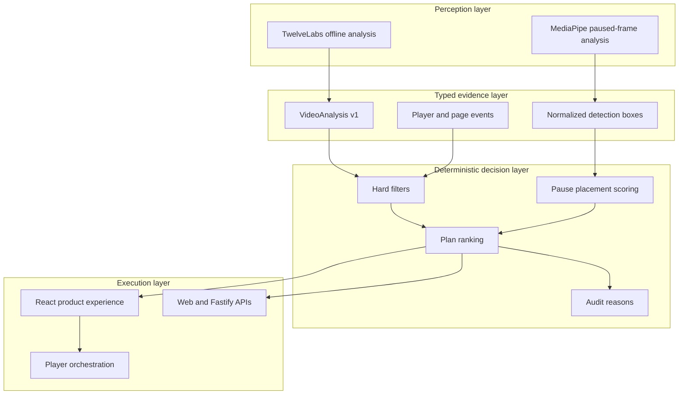
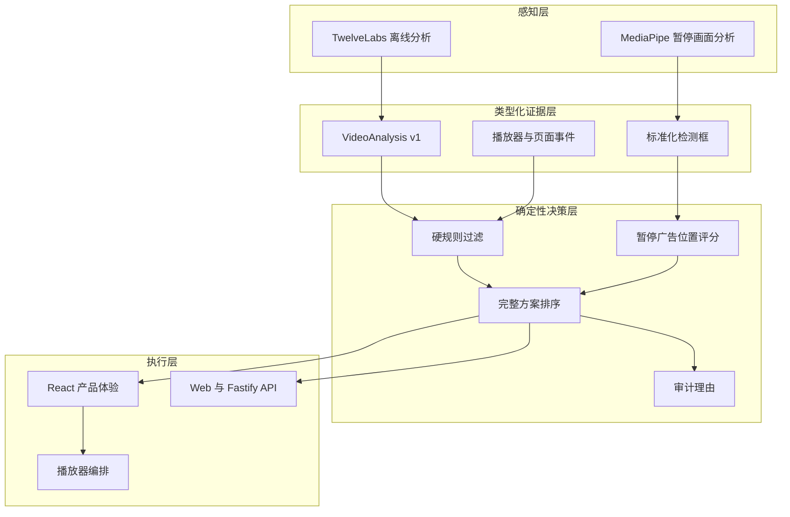

# Architecture

[English](#architecture) · [中文](#架构说明)

AdMind separates probabilistic video perception from deterministic advertising policy. AI output can describe evidence, but it cannot bypass eligibility, player-state or ethical constraints.

## System overview



## Scenario flows

### S1 · Climax avoidance

1. A licensed clip is analyzed offline by the selected provider.
2. The provider response is normalized into time-coded `VideoAnalysis` segments.
3. Repeated runs may be aggregated to expose timestamp agreement and disagreement.
4. The engine evaluates complete plans rather than isolated timestamps.
5. A fixed break is compared with a safer window, a lower-disruption format or a deferred task.
6. The UI displays the active segment, evidence score and deterministic decision reason.

### S2 · Pause protection

1. The player emits pause, play and seeking events.
2. The page contributes visibility and focus state.
3. A short stabilization window rejects accidental or transient pauses.
4. MediaPipe inspects the current frame locally in the browser.
5. Detection boxes are normalized and scored against four candidate corners.
6. The decision can show a small card, upgrade after a longer pause, reject all unsafe positions or defer the task.
7. Resume, seeking and invalid state transitions clean up ads and stale detections.

### S3 · Ethical boundary

1. Cached semantic evidence identifies rescue, medical, disaster or trauma context.
2. Protected-context rules execute before commercial ranking.
3. A matching hard rule blocks the in-content plan.
4. The system records the rejected opportunity and delivery shortfall rather than weakening the rule.

## Decision invariant

The engine evaluates a complete execution plan:

```text
campaign + approved creative + opportunity + scheduled time + format + position
```

Hard constraints always execute before utility ranking. A rejected plan cannot return to the candidate set because of bid value, predicted completion or model confidence.

## Repository boundaries

| Path | Responsibility |
| --- | --- |
| `app/` | Product experience, scenario orchestration and co-located API route. |
| `app/components/ShowcaseDemo.tsx` | Player events, scenario UI, S2 state machine and ad lifecycle. |
| `app/lib/face-detector.ts` | Lazy MediaPipe loading and paused-frame detection. |
| `app/lib/pause-decision.ts` | Candidate-corner overlap and risk scoring. |
| `packages/contracts/` | Runtime-validated Zod contracts and shared TypeScript types. |
| `packages/decision-engine/` | Hard filters, ranking, fixtures and scenario construction. |
| `packages/video-analyzer/` | Provider adapters, prompt, normalization and consensus. |
| `analysis/runs/` | Validated cached evidence consumed by the site. |
| `analysis/raw/` | Original provider responses retained for traceability. |
| `services/api/` | Standalone Fastify integration adapter. |
| `worker/` | Deployed media routing and worker entry point. |

The UI and both API adapters call the same engine. This prevents the demonstration from becoming a disconnected mockup.

## Trust boundaries

- Provider text never flows directly into an executable decision.
- Zod validation rejects malformed evidence and requests.
- Provider keys are read only by local/server-side analysis commands.
- The deployed experience uses cached analysis and requires no visitor credentials.
- S2 frame inference is local to the browser and is triggered only after a stable pause.
- Evidence scores describe model support; they are not calibrated probabilities or statistical confidence intervals.

## Deployment

The web experience uses vinext, Vite and a Cloudflare-compatible worker output. `.openai/hosting.json` stores the Sites project binding, while secrets remain outside source control. The repository's `main` branch is the durable GitHub source; production releases should be created only from a validated, committed source state.

## Known architectural limits

- The current S1/S3 dataset is intentionally small and scenario-driven.
- S2 uses lightweight on-device models and conservative placement rules rather than general scene understanding.
- Deferred campaign state is session-local in the demo.
- Persistent audit history and production campaign administration are designed but not wired into the public experience.

---

# 架构说明

AdMind 把概率性的视频感知与确定性的广告政策分开。AI 输出可以描述证据，但不能绕过素材资格、播放器状态或伦理约束。

## 系统概览



## 场景链路

### S1 · 剧情高点避让

1. 使用选定服务商离线分析具有合法使用权的视频。
2. 服务商返回值被标准化为带时间码的 `VideoAnalysis` 片段。
3. 多次运行可以聚合，用于展示时间点的一致和分歧。
4. 引擎评估完整执行方案，而不是孤立的时间戳。
5. 固定广告点会与更安全的窗口、更低打断的形式或顺延任务比较。
6. 界面展示当前片段、证据分数和确定性的决策理由。

### S2 · 暂停保护

1. 播放器产生暂停、播放和拖动事件。
2. 页面提供可见性与焦点状态。
3. 短暂稳定窗口会过滤误触和瞬时暂停。
4. MediaPipe 在浏览器本地检查当前画面。
5. 检测框被标准化，并与四个候选角落计算风险。
6. 决策可以展示小卡片、在较长暂停后升级、拒绝全部不安全位置或顺延任务。
7. 恢复播放、拖动和非法状态切换会清理广告和过期检测结果。

### S3 · 伦理边界

1. 缓存的语义证据识别救援、医疗、灾难或创伤语境。
2. 受保护场景规则先于商业排序执行。
3. 命中的硬规则会阻止内容内广告方案。
4. 系统记录被拒绝机会和交付缺口，而不会放松规则。

## 决策不变量

引擎评估的是完整方案：

```text
广告活动 + 已审批素材 + 广告机会 + 计划时间 + 形式 + 位置
```

硬约束始终先于效用排序。被拒绝的方案不能因为出价、预测完成率或模型证据分数重新进入候选集。

## 仓库边界

| 路径 | 职责 |
| --- | --- |
| `app/` | 产品体验、场景编排和同仓 Web API。 |
| `app/components/ShowcaseDemo.tsx` | 播放器事件、场景界面、S2 状态机和广告生命周期。 |
| `app/lib/face-detector.ts` | MediaPipe 延迟加载和暂停画面检测。 |
| `app/lib/pause-decision.ts` | 候选角落重叠与风险评分。 |
| `packages/contracts/` | Zod 运行时校验契约和共享 TypeScript 类型。 |
| `packages/decision-engine/` | 硬规则、排序、固定样本和场景构造。 |
| `packages/video-analyzer/` | 服务商适配、Prompt、标准化和多次运行共识。 |
| `analysis/runs/` | 网站实际读取的已校验缓存证据。 |
| `analysis/raw/` | 为可追溯性保留的服务商原始输出。 |
| `services/api/` | 独立 Fastify 集成适配器。 |
| `worker/` | 线上媒体路由和 Worker 入口。 |

界面和两个 API 适配器调用同一个决策引擎，避免产品演示沦为与真实逻辑断开的静态假页面。

## 信任边界

- 服务商文本不会直接进入可执行决定。
- Zod 校验会拒绝格式错误的证据和请求。
- 服务商密钥只由本地或服务端分析命令读取。
- 线上体验使用缓存分析，不要求访客提供凭证。
- S2 画面推理只在浏览器本地、稳定暂停后触发。
- 证据分数表示模型支持程度，不是校准概率或统计学置信区间。

## 部署

网页体验使用 vinext、Vite 和兼容 Cloudflare 的 Worker 输出。`.openai/hosting.json` 保存 Sites 项目绑定，密钥不进入源码。GitHub `main` 是长期代码事实来源；生产发布只能来自已经提交并通过验证的源码状态。

## 已知架构边界

- 当前 S1/S3 数据集规模较小，按产品场景组织。
- S2 使用轻量级端侧模型和保守位置规则，不代表通用场景理解。
- Demo 的广告顺延状态只存在于当前会话。
- 持久化审计历史和生产广告活动管理已有设计，但尚未接入公开体验。
