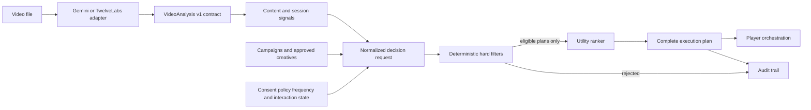

# AdMind architecture

AdMind is a policy-first decision system, not an ad blocker and not an LLM that directly decides what may be shown.

## Repository boundaries

- `app/` — interactive product console and deployable web route.
- `packages/contracts/` — Zod runtime contracts and TypeScript types.
- `packages/decision-engine/` — deterministic filters, ranking, fixtures and tests.
- `packages/video-analyzer/` — Gemini and TwelveLabs adapters, one shared perception prompt, and response normalization.
- `analysis/` — cached `VideoAnalysis` documents. Fixture and live outputs use the same runtime-validated contract.
- `services/api/` — standalone Fastify adapter for production-style integration.
- `app/api/decisions/` — co-located HTTP adapter so the demo remains one-command runnable.
- `db/` — Drizzle persistence adapter boundary; persistence is intentionally not required for the current deterministic scenarios.

The same engine powers the page, the co-located route, and the Fastify service. This prevents the portfolio UI from becoming a disconnected mockup.

## Decision invariant

Ranking evaluates a complete plan:

`campaign + approved creative + viewer/opportunity + scheduled time + format`

Hard rules run before ranking. A rejected plan can never win because of a high bid or model score.

## Current slice and next slices

Version 0.2 implements S1 climax scheduling, S2 pause-task interaction protection, and S3 protected-context blocking through the deterministic layer. Provider adapters are executable locally; the checked-in CHARGE result remains a labeled human baseline until credentials are supplied and the two providers are evaluated.
