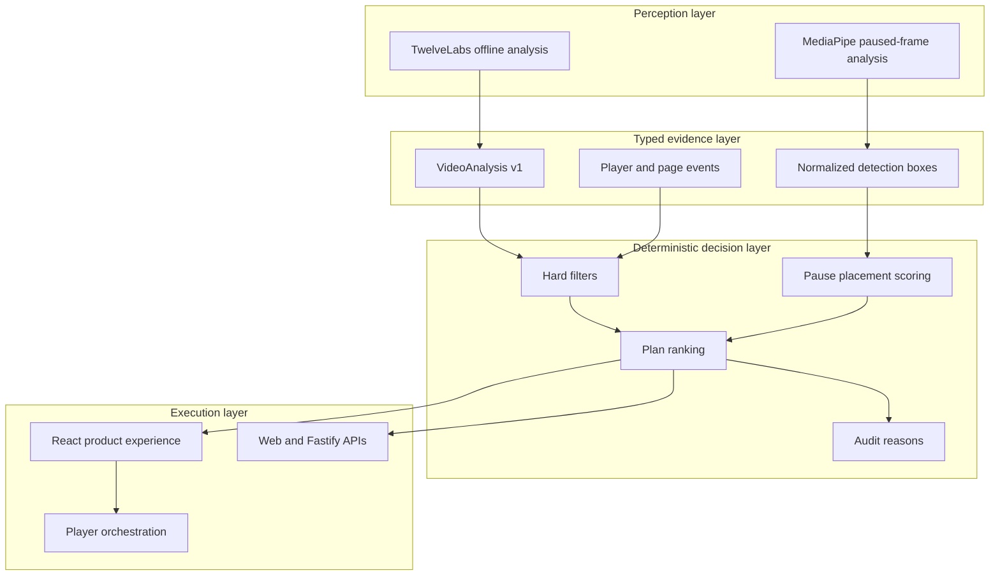

# Architecture

AdMind separates probabilistic video perception from deterministic advertising policy. AI output can describe evidence, but it cannot bypass eligibility, player-state or ethical constraints.

## System overview



## Scenario flows

### S1 · Climax avoidance

1. A licensed clip is analyzed offline by the selected provider.
2. The provider response is normalized into time-coded `VideoAnalysis` segments.
3. Repeated runs may be aggregated to expose timestamp agreement and disagreement.
4. The engine evaluates complete plans rather than isolated timestamps.
5. A fixed break is compared with a safer window, a lower-disruption format or a deferred task.
6. The UI displays the active segment, evidence score and deterministic decision reason.

### S2 · Pause protection

1. The player emits pause, play and seeking events.
2. The page contributes visibility and focus state.
3. A short stabilization window rejects accidental or transient pauses.
4. MediaPipe inspects the current frame locally in the browser.
5. Detection boxes are normalized and scored against four candidate corners.
6. The decision can show a small card, upgrade after a longer pause, reject all unsafe positions or defer the task.
7. Resume, seeking and invalid state transitions clean up ads and stale detections.

### S3 · Ethical boundary

1. Cached semantic evidence identifies rescue, medical, disaster or trauma context.
2. Protected-context rules execute before commercial ranking.
3. A matching hard rule blocks the in-content plan.
4. The system records the rejected opportunity and delivery shortfall rather than weakening the rule.

## Decision invariant

The engine evaluates a complete execution plan:

```text
campaign + approved creative + opportunity + scheduled time + format + position
```

Hard constraints always execute before utility ranking. A rejected plan cannot return to the candidate set because of bid value, predicted completion or model confidence.

## Repository boundaries

| Path | Responsibility |
| --- | --- |
| `app/` | Product experience, scenario orchestration and co-located API route. |
| `app/components/ShowcaseDemo.tsx` | Player events, scenario UI, S2 state machine and ad lifecycle. |
| `app/lib/face-detector.ts` | Lazy MediaPipe loading and paused-frame detection. |
| `app/lib/pause-decision.ts` | Candidate-corner overlap and risk scoring. |
| `packages/contracts/` | Runtime-validated Zod contracts and shared TypeScript types. |
| `packages/decision-engine/` | Hard filters, ranking, fixtures and scenario construction. |
| `packages/video-analyzer/` | Provider adapters, prompt, normalization and consensus. |
| `analysis/runs/` | Validated cached evidence consumed by the site. |
| `analysis/raw/` | Original provider responses retained for traceability. |
| `services/api/` | Standalone Fastify integration adapter. |
| `worker/` | Deployed media routing and worker entry point. |

The UI and both API adapters call the same engine. This prevents the demonstration from becoming a disconnected mockup.

## Trust boundaries

- Provider text never flows directly into an executable decision.
- Zod validation rejects malformed evidence and requests.
- Provider keys are read only by local/server-side analysis commands.
- The deployed experience uses cached analysis and requires no visitor credentials.
- S2 frame inference is local to the browser and is triggered only after a stable pause.
- Evidence scores describe model support; they are not calibrated probabilities or statistical confidence intervals.

## Deployment

The web experience uses vinext, Vite and a Cloudflare-compatible worker output. `.openai/hosting.json` stores the Sites project binding, while secrets remain outside source control. The repository's `main` branch is the durable GitHub source; production releases should be created only from a validated, committed source state.

## Known architectural limits

- The current S1/S3 dataset is intentionally small and scenario-driven.
- S2 uses lightweight on-device models and conservative placement rules rather than general scene understanding.
- Deferred campaign state is session-local in the demo.
- Persistent audit history and production campaign administration are designed but not wired into the public experience.
