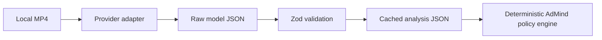

# Video analyzer

AdMind does not train a video-understanding model. It treats video perception as a replaceable upstream capability and owns the normalized contract, policy boundary, decision plan, and audit trail.

## Contract

Every provider produces `VideoAnalysis` v1:

- source metadata and provenance (`provider`, `mode`, `model`);
- time-coded content segments;
- narrative, motion and audio intensity;
- dialogue, transition and sensitive-context evidence;
- candidate break points with `allow`, `delay`, or `block` recommendations;
- explicit uncertainty and limitations.

Runtime validation lives in `packages/contracts`. Model prose is never passed directly to the decision engine.

## Provider workflow

The Gemini adapter uploads the video through the Files API, waits for processing, requests JSON, validates it, and removes the temporary remote file. The TwelveLabs adapter creates an asset, waits until it is ready, runs Pegasus analysis, and normalizes the response.

## Current evidence status

`analysis/charge-curated.json` is a human-authored fixture used to prove the contract and downstream wiring. It is deliberately marked `provider: curated` and `mode: fixture`. It must not be described as a model benchmark.

The next evaluation runs the same CHARGE clip and prompt through both providers, then compares:

1. whether the fight interval is identified;
2. whether the recovery boundary near the end is identified;
3. timestamp stability across repeated runs;
4. schema validity and amount of manual repair;
5. latency and cost.
