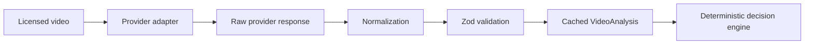

# Video analyzer

AdMind does not train a general video-understanding model. It treats perception as a replaceable upstream capability and owns the normalized evidence contract, policy boundary, executable decision and audit trail.

## Contract

Every offline provider produces `VideoAnalysis` v1 with:

- source metadata and provenance;
- time-coded content segments;
- narrative, motion and audio intensity;
- dialogue, transition and sensitive-context evidence;
- candidate break recommendations;
- explicit scores and limitations; and
- a provider/model identifier for traceability.

Runtime validation lives in `packages/contracts`. Provider prose never flows directly into the decision engine.

## Offline semantic workflow



The TwelveLabs adapter uploads the supplied clip, waits for the asset to become ready, requests Pegasus analysis and normalizes the response. Raw output is retained separately from the validated run so later changes remain auditable.

The Gemini adapter remains in the provider abstraction for experimentation but is not part of the current product path.

## Live paused-frame workflow

S2 is intentionally different from S1 and S3:

1. The player reaches a stable pause.
2. MediaPipe Tasks Vision loads lazily in the browser.
3. The current frame is inspected locally.
4. Detection rectangles are normalized and deduplicated.
5. `app/lib/pause-decision.ts` scores four candidate regions.
6. Deterministic state and risk rules choose a position, defer or reject.

If the browser model fails, the UI reports a fallback state and uses conservative layout protection. It does not fabricate a successful detection.

## Current evidence status

Validated TwelveLabs runs under `analysis/runs/` currently cover:

- CHARGE, including two runs used for consensus;
- Coffee Run;
- Caminandes: Llamigos;
- U.S. Coast Guard rescue footage;
- USNS Comfort medical evacuation footage; and
- FEMA hurricane recovery footage.

Original provider responses are retained under `analysis/raw/`. The product reads the normalized runs, which means the hosted demo does not perform paid inference per visitor.

These examples prove the integration path and scenario behavior; they are not a broad accuracy benchmark. Evidence scores describe support from a particular provider output and must not be presented as calibrated correctness probabilities.

## Running analysis

Create `.env.local` with `TWELVELABS_API_KEY`, then run:

```bash
pnpm analyze:video \
  --provider twelvelabs \
  --file path/to/licensed-video.mp4 \
  --duration 90 \
  --output analysis/runs/example.json \
  --raw-output analysis/raw/example.json
```

Only analyze media you are authorized to upload to the selected provider. Review provider retention and data-processing terms before using confidential footage.

## Evaluation priorities

- timestamp consistency across repeated runs;
- protected-context recall;
- segment-boundary usefulness for executable decisions;
- schema validity and manual-repair rate;
- latency and provider cost; and
- S2 false negatives, false positives and placement accuracy on a fixed frame set.
